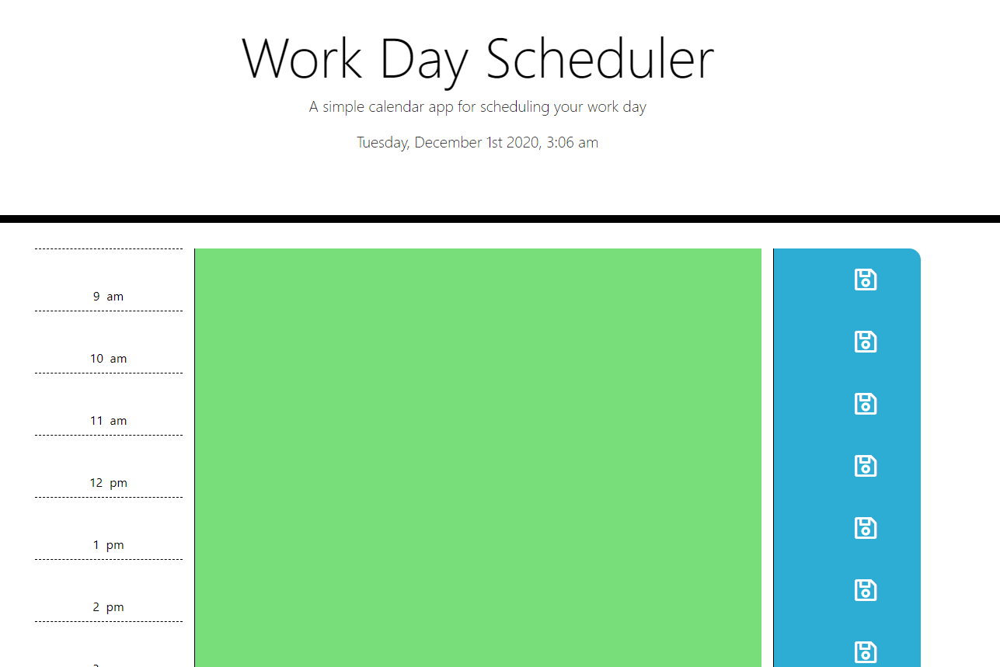

# Work Day Scheduler

A simple calendar application that is ideal for each hour of a 9AM-5PM workday. There is a section to save events for each hour of the day. Therefore, allowing the user to manage their time effectively. Happy Planning!

## At a Glance

## Built with
* JavaScript
* [MomentJS](https://momentjs.com/)
* HTML
* [Bootstrap](https://getbootstrap.com/)
* CSS
* [Github](https://github.com/)

## Deployed Link
[Work Day Scheduler](https://fevia.github.io/Work-Day-Scheduler/)
